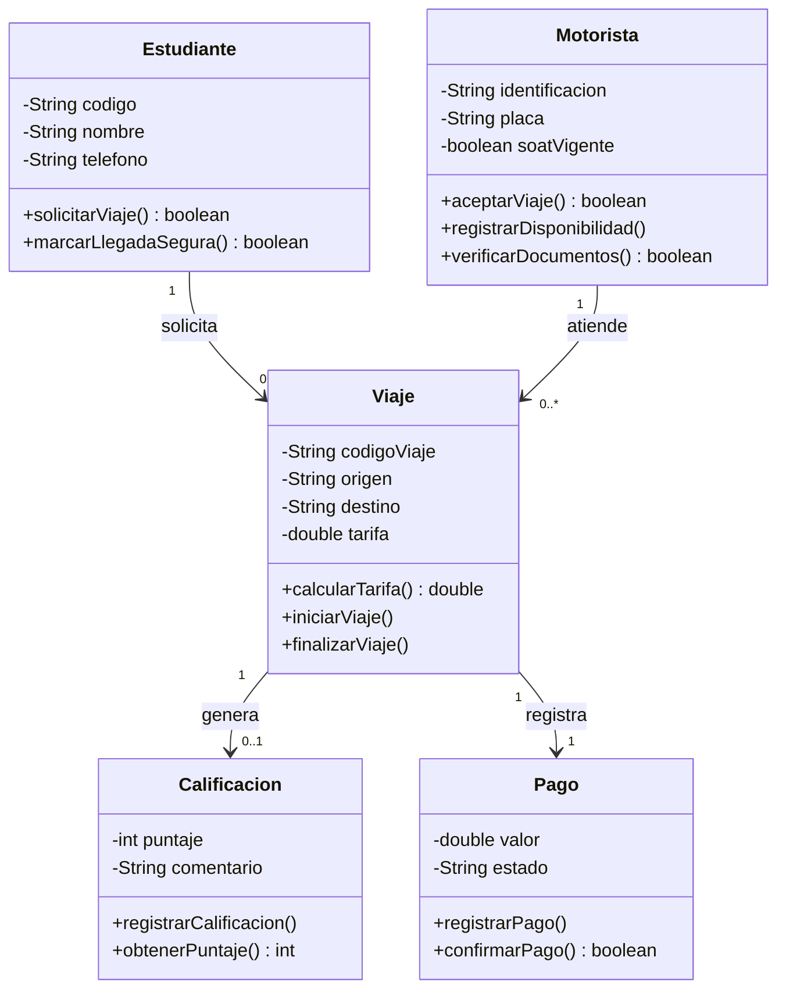

# TucanGo — Diagrama UML v1.0 (Entregable Guía 2)

> **Contexto:** Modelo del "Mundo del Problema" para la problemática de transporte informal
> en motocicleta (mototaxis) alrededor del campus universitario.
> **Guías de referencia:** Guía 1 (Semana 1) y Guía 2 (Semana 2 — Abstracción y el Mundo del Problema).
> **Restricción Guía 2:** *No escribir código Java ni usar IDEs durante esta modelación. Orden: Pensar → Abstraer → Modelar.*

---

## 1. Bitácora de Empatía (Guía 1)

| Campo | Registro |
|-------|----------|
| **Contexto seleccionado** | Otro — *Movilidad estudiantil / transporte informal en motocicleta (mototaxis) alrededor del campus* |
| **Problemática observada** | Los estudiantes usan mototaxis para ir y volver del campus, pero el servicio opera sin control: sin registro de quién conduce, sin tarifa definida, sin forma de saber si el viaje fue seguro. El riesgo percibido es mayor para las estudiantes mujeres. Los motoristas trabajan sin ingreso estable ni respaldo. |
| **Usuario / Entidad afectada** | Estudiante (seguridad y tarifa justa), Motorista (formalización e ingreso), Universidad (bienestar y responsabilidad) |

---

## 2. Descubrimiento Lingüístico — Señal vs. Ruido (Guía 2)

| El ruido (no modelar) | La señal (modelar) |
|----------------------|-------------------|
| Marca/color de la moto | Identidad y documentos del motorista |
| Edad o ropa del conductor | SOAT vigente / verificación |
| Dónde compró el casco | Origen, destino y tarifa del viaje |
| — | Calificación del servicio (seguridad) |
| — | Pago registrado |

- **Sustantivos → clases:** `Estudiante`, `Motorista`, `Viaje`, `Calificacion`, `Pago`.
- **Verbos → responsabilidades:** `solicitarViaje()`, `aceptarViaje()`, `calcularTarifa()`, `finalizarViaje()`, `calificar()`, `registrarPago()`.

---

## 3. Definición de las 5 Clases (Guía 2: 3–5 clases, mínimo 2 atributos + 1 responsabilidad justificada por clase)

### `Estudiante` — quien solicita el viaje
| Visibilidad | Tipo | Nombre | Propósito / Justificación |
|-------------|------|--------|---------------------------|
| `private` | `String` | `codigo` | Identificador único que vincula al estudiante con sus viajes |
| `private` | `String` | `nombre` | Identificación para seguridad |
| `private` | `String` | `telefono` | Contacto / alertas de emergencia |

| Visibilidad | Retorno | Nombre | Responsabilidad |
|-------------|---------|--------|-----------------|
| `public` | `boolean` | `solicitarViaje()` | Pedir un viaje dentro del sistema |
| `public` | `boolean` | `marcarLlegadaSegura()` | Confirmar que llegó sano y salvo a su destino |

---

### `Motorista` — el conductor verificado
| Visibilidad | Tipo | Nombre | Propósito / Justificación |
|-------------|------|--------|---------------------------|
| `private` | `String` | `identificacion` | Vínculo legal (cédula / licencia) |
| `private` | `String` | `placa` | Identifica el vehículo autorizado |
| `private` | `boolean` | `soatVigente` | Requisito de verificación y seguridad |

| Visibilidad | Retorno | Nombre | Responsabilidad |
|-------------|---------|--------|-----------------|
| `public` | `boolean` | `aceptarViaje()` | Tomar una solicitud de viaje |
| `public` | `void` | `registrarDisponibilidad()` | Indicar cuándo está disponible |
| `public` | `boolean` | `verificarDocumentos()` | Validar su identificación y SOAT |

---

### `Viaje` — la transacción núcleo
| Visibilidad | Tipo | Nombre | Propósito / Justificación |
|-------------|------|--------|---------------------------|
| `private` | `String` | `codigoViaje` | Trazabilidad (qué pasó, cuándo, con quién) |
| `private` | `String` | `origen` | Punto de partida |
| `private` | `String` | `destino` | Punto de llegada |
| `private` | `double` | `tarifa` | Base del "pago justo" |

| Visibilidad | Retorno | Nombre | Responsabilidad |
|-------------|---------|--------|-----------------|
| `public` | `double` | `calcularTarifa()` | Determinar el valor del viaje |
| `public` | `void` | `iniciarViaje()` | Marcar el inicio del recorrido |
| `public` | `void` | `finalizarViaje()` | Marcar el fin del recorrido |

---

### `Calificacion` — la confianza / seguridad
| Visibilidad | Tipo | Nombre | Propósito / Justificación |
|-------------|------|--------|---------------------------|
| `private` | `int` | `puntaje` | 1–5, reputación del servicio |
| `private` | `String` | `comentario` | Registro de incidentes / feedback |

| Visibilidad | Retorno | Nombre | Responsabilidad |
|-------------|---------|--------|-----------------|
| `public` | `void` | `registrarCalificacion()` | Guardar la evaluación del viaje |
| `public` | `int` | `obtenerPuntaje()` | Consultar el puntaje registrado |

---

### `Pago` — lo económico formalizado
| Visibilidad | Tipo | Nombre | Propósito / Justificación |
|-------------|------|--------|---------------------------|
| `private` | `double` | `valor` | Monto acordado |
| `private` | `String` | `estado` | pendiente / confirmado |

| Visibilidad | Retorno | Nombre | Responsabilidad |
|-------------|---------|--------|-----------------|
| `public` | `void` | `registrarPago()` | Registrar el pago del viaje |
| `public` | `boolean` | `confirmarPago()` | Confirmar que el pago se realizó |

---

## 4. Asociaciones y Multiplicidades (requisito Guía 2)

| Asociación | Multiplicidad | Significado |
|------------|---------------|-------------|
| `Estudiante` → `Viaje` | `1 ── 0..*` | Un estudiante genera muchos viajes |
| `Motorista` → `Viaje` | `1 ── 0..*` | Un motorista atiende muchos viajes |
| `Viaje` → `Calificacion` | `1 ── 0..1` | Cada viaje se califica a lo sumo una vez |
| `Viaje` → `Pago` | `1 ── 1` | Cada viaje tiene un único pago |

---

## 5. Diagrama UML v1.0 — Código Mermaid

> **Cómo usarlo:** Copia el bloque de abajo y pégalo en **Mermaid Live Editor** (https://mermaid.live/), en **VS Code** (extensión *Markdown Preview Mermaid Support*), o GitHub lo renderiza nativamente en archivos `.md`.



---

## 6. Diagrama UML v1.0 — Representación Textual (para Bitácora impresa)

```
+------------------+           0..*           +----------+           0..*           +------------------+
|   Estudiante     | ------------------------ |  Viaje   | ------------------------ |    Motorista     |
+------------------+           solicita       +----------+           atiende        +------------------+
| - codigo: String |                          | - codigoViaje: String|                | - identificacion |
| - nombre: String |                          | - origen: String    |                | - placa: String  |
| - telefono: Str  |                          | - destino: String   |                | - soatVigente:bool|
+------------------+                          | - tarifa: double    |                +------------------+
| + solicitarViaje() |                        +----------+           | + aceptarViaje()  |
| + marcarLlegadaSegura()|                       | 1   | 0..1        | + registrarDisp() |
+------------------+                          |  |  |             | + verificarDocs() |
                                             |  |  |             +------------------+
                                          1   |  |  | 0..1
                                             v  v  v
                                      +------------------+       1        +----------+
                                      |  Calificacion    | <------------- |   Pago   |
                                      +------------------+   registra     +----------+
                                      | - puntaje: int   |               | - valor: double |
                                      | - comentario:Str |               | - estado: String|
                                      +------------------+               +----------+
                                      | + registrarCal() |
                                      | + obtenerPuntaje()|
                                      +------------------+
```

---

## 7. Checklist de Validación Lógica (Guía 1 + Guía 2)

- [x] **Nombres de clases:** sustantivos en singular, UpperCamelCase (`Estudiante`, `Motorista`, `Viaje`, `Calificacion`, `Pago`).
- [x] **Atributos:** `private`, lowerCamelCase, tipos coherentes (`String`, `int`, `double`, `boolean`).
- [x] **Métodos:** `public`, verbos en infinitivo, lowerCamelCase (`solicitarViaje`, `calcularTarifa`, `verificarDocumentos`).
- [x] **Mínimo 2 atributos + 1 responsabilidad por clase** (todas las 5 clases cumplen).
- [x] **Asociaciones y multiplicidades lógicas** establecidas (4 relaciones con su cardinalidad).
- [x] **Justificación desde la necesidad del usuario** en cada atributo y método.
- [x] **Modelo responde a necesidad real** observada en el contexto universitario (movilidad, seguridad, formalización).
- [x] **Encuadre responsable:** el sistema no habilita transporte público ilegal; modela capa de verificación, trazabilidad, reputación y pago sobre motoristas autorizados dentro del ámbito del campus.

---

## 8. Encuadre Responsable (clave para la defensa)

Este modelo se plantea como una **capa de seguridad y confianza sobre motoristas previamente verificados dentro del ámbito del campus** (identificación, placa y SOAT vigente), con la Universidad como garante de bienestar. **No** habilita ni legaliza el transporte público de pasajeros en moto (actividad no permitida a nivel nacional en Colombia); el sistema se concentra en lo que la Universidad sí puede controlar: **verificación, trazabilidad, reputación y pago**.

---

## 9. Próximos pasos (post Guía 2)

1. Confirmar los 4 integrantes del equipo y completar la tabla en `README.md`.
2. Traducir este modelo conceptual (5 clases) a código Java del dominio (`src/.../modelo/*.java`).
3. Agregar la capa `servicio` con la lógica de negocio.
4. Agregar la capa `persistencia` para guardar/cargar datos.
5. Conectar la capa `vista` (menú por consola).
6. Incorporar JUnit para pruebas unitarias.

---

> **Archivos relacionados en el repo:**
> - `README.md` — Identidad del proyecto, equipo (4 pendientes), roadmap.
> - `Docs/modelo-conceptual.md` — Bitácora completa, análisis señal/ruido, clases, UML (este diagrama).
> - `Docs/Sem1Est (1).pdf` — Guía 1 del profesor.
> - `Docs/Sem2_Expo2.pdf` — Guía 2 del profesor (diapositivas).
> - `openspec/` — Configuración SDD para futuras fases.
> - `Gestion_Tareas_Equipo_LogicaII.xlsx` — Gestión de tareas del equipo (4 integrantes).