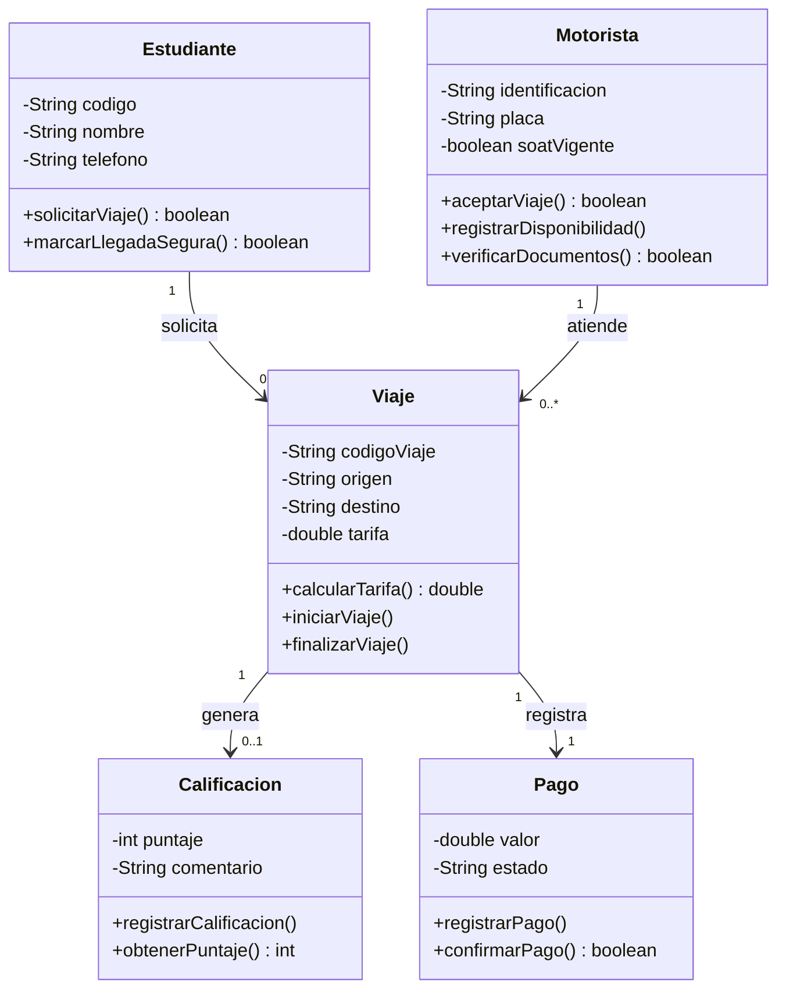

# TucanGo — Modelo Conceptual (Guía 2)

Documento del **Mundo del Problema** y su abstracción hacia el **Mundo de la
Solución**, conforme a las Guías 1 y 2 del curso Lógica & Algoritmos II.

- **Guía 1:** Bitácora de Empatía, estándares Java, clase principal.
- **Guía 2:** Abstracción (señal/ruido), descubrimiento lingüístico, UML v1.0 con
  3–5 clases, asociaciones y multiplicidades. *Restricción: no escribir código Java
  ni usar IDE durante la modelación.*

---

## 1. Bitácora de Empatía (Guía 1)

**Contexto seleccionado:** Otro — *Movilidad estudiantil / transporte informal en
motocicleta (mototaxis) alrededor del campus.*

**Problemática observada:** Los estudiantes usan mototaxis para ir y volver del
campus, pero el servicio opera sin ningún control: sin registro de quién conduce,
sin tarifa definida y sin forma de saber si el viaje fue seguro. Para las
estudiantes mujeres el riesgo percibido es mayor. Los motoristas, a su vez,
trabajan sin ingreso estable ni respaldo.

**Usuario / Entidad afectada:**

| Quién | Necesidad |
|-------|-----------|
| Estudiante | Seguridad (llegar sano y salvo) y tarifa justa |
| Motorista | Formalización, ingreso estable y "clientes" asegurados |
| Universidad | Bienestar y responsabilidad sobre su comunidad |

---

## 2. Descubrimiento lingüístico — Señal vs. Ruido (Guía 2)

| El ruido (no modelar) | La señal (modelar) |
|---|---|
| Marca/color de la moto | Identidad y documentos del motorista |
| Edad o ropa del conductor | SOAT vigente / verificación |
| Dónde compró el casco | Origen, destino y tarifa del viaje |
| — | Calificación del servicio (seguridad) |
| — | Pago registrado |

- **Sustantivos → clases:** `Estudiante`, `Motorista`, `Viaje`, `Calificacion`, `Pago`.
- **Verbos → responsabilidades:** `solicitarViaje()`, `aceptarViaje()`,
  `calcularTarifa()`, `finalizarViaje()`, `calificar()`, `registrarPago()`.

---

## 3. Las 5 clases

> Cada clase cumple: mínimo 2 atributos y 1 responsabilidad **justificada desde la
> necesidad del usuario**. Nomenclatura según estándares del curso.

### `Estudiante` — quien solicita el viaje

| Visibilidad | Tipo | Nombre | Propósito / Justificación |
|---|---|---|---|
| `private` | `String` | `codigo` | Identificador único que vincula al estudiante con sus viajes |
| `private` | `String` | `nombre` | Identificación para seguridad |
| `private` | `String` | `telefono` | Contacto / alertas de emergencia |

**Métodos (responsabilidades):**

| Visibilidad | Retorno | Nombre | Responsabilidad |
|---|---|---|---|
| `public` | `boolean` | `solicitarViaje()` | Pedir un viaje dentro del sistema |
| `public` | `boolean` | `marcarLlegadaSegura()` | Confirmar que llegó sano y salvo a su destino |

### `Motorista` — el conductor verificado

| Visibilidad | Tipo | Nombre | Propósito / Justificación |
|---|---|---|---|
| `private` | `String` | `identificacion` | Vínculo legal (cédula / licencia) |
| `private` | `String` | `placa` | Identifica el vehículo autorizado |
| `private` | `boolean` | `soatVigente` | Requisito de verificación y seguridad |

**Métodos (responsabilidades):**

| Visibilidad | Retorno | Nombre | Responsabilidad |
|---|---|---|---|
| `public` | `boolean` | `aceptarViaje()` | Tomar una solicitud de viaje |
| `public` | `void` | `registrarDisponibilidad()` | Indicar cuándo está disponible |
| `public` | `boolean` | `verificarDocumentos()` | Validar su identificación y SOAT |

### `Viaje` — la transacción núcleo

| Visibilidad | Tipo | Nombre | Propósito / Justificación |
|---|---|---|---|
| `private` | `String` | `codigoViaje` | Trazabilidad (qué pasó, cuándo, con quién) |
| `private` | `String` | `origen` | Punto de partida |
| `private` | `String` | `destino` | Punto de llegada |
| `private` | `double` | `tarifa` | Base del "pago justo" |

**Métodos (responsabilidades):**

| Visibilidad | Retorno | Nombre | Responsabilidad |
|---|---|---|---|
| `public` | `double` | `calcularTarifa()` | Determinar el valor del viaje |
| `public` | `void` | `iniciarViaje()` | Marcar el inicio del recorrido |
| `public` | `void` | `finalizarViaje()` | Marcar el fin del recorrido |

### `Calificacion` — la confianza / seguridad

| Visibilidad | Tipo | Nombre | Propósito / Justificación |
|---|---|---|---|
| `private` | `int` | `puntaje` | 1–5, reputación del servicio |
| `private` | `String` | `comentario` | Registro de incidentes / feedback |

**Métodos (responsabilidades):**

| Visibilidad | Retorno | Nombre | Responsabilidad |
|---|---|---|---|
| `public` | `void` | `registrarCalificacion()` | Guardar la evaluación del viaje |
| `public` | `int` | `obtenerPuntaje()` | Consultar el puntaje registrado |

### `Pago` — lo económico formalizado

| Visibilidad | Tipo | Nombre | Propósito / Justificación |
|---|---|---|---|
| `private` | `double` | `valor` | Monto acordado |
| `private` | `String` | `estado` | pendiente / confirmado |

**Métodos (responsabilidades):**

| Visibilidad | Retorno | Nombre | Responsabilidad |
|---|---|---|---|
| `public` | `void` | `registrarPago()` | Registrar el pago del viaje |
| `public` | `boolean` | `confirmarPago()` | Confirmar que el pago se realizó |

---

## 4. Asociaciones y multiplicidades

- `Estudiante` **1 ── 0..\*** `Viaje` — un estudiante genera muchos viajes.
- `Motorista` **1 ── 0..\*** `Viaje` — un motorista atiende muchos viajes.
- `Viaje` **1 ── 0..1** `Calificacion` — cada viaje se califica a lo sumo una vez.
- `Viaje` **1 ── 1** `Pago` — cada viaje tiene un único pago.

---

## 5. Diagrama UML v1.0

---

## 6. Encuadre responsable

Este modelo se plantea como una **capa de seguridad y confianza sobre motoristas
previamente verificados dentro del ámbito del campus** (identificación, placa y
SOAT vigente), con la Universidad como garante de bienestar. **No** habilita ni
legaliza el transporte público de pasajeros en moto (actividad no permitida a
nivel nacional en Colombia); el sistema se concentra en lo que la Universidad sí
puede controlar: **verificación, trazabilidad, reputación y pago**.
