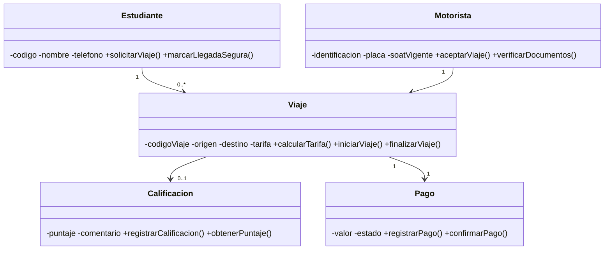

# TucanGo — Presentación del Proyecto

> **Curso:** Lógica & Algoritmos II  
> **Universidad:** Universidad de la Amazonia — Ingeniería de Sistemas  
> **Equipo:** Jhonatan A. Saavedra C., Gian M. Castañeda S., Andrés D. Pinilla P., Juan G. Ferrer G.  
> **Repositorio:** https://github.com/Stellel-One/TucanGo

---

## 1. Portada

# TucanGo
## Movilidad estudiantil segura en el campus
### Modelo POO + UML v1.0 — Guía 2

---

## 2. Problemática

**El transporte informal en motocicleta (mototaxis) alrededor del campus:**

- ❌ **Sin control:** no hay registro de quién conduce
- ❌ **Sin trazabilidad:** no se sabe si un viaje fue seguro
- ❌ **Tarifas arbitrarias:** no hay “pago justo”
- ⚠️ **Riesgo diferenciado:** mayor percepción de inseguridad en estudiantes mujeres
- 🏍️ **Motoristas informales:** sin ingreso estable ni respaldo institucional

> *“Dos mundos operando en paralelo: la Universidad y el transporte informal. TucanGo los entrelaza.”*

---

## 3. Objetivos

### Objetivo General
Diseñar un **modelo orientado a objetos (UML v1.0)** que formalice la relación estudiante–motorista mediante **verificación, trazabilidad, reputación y pago**, dentro del ámbito de control de la Universidad.

### Objetivos Específicos
| # | Objetivo |
|---|----------|
| 1 | Identificar entidades del “Mundo del Problema” (Guía 2: descubrimiento lingüístico) |
| 2 | Definir 5 clases con ≥2 atributos y ≥1 responsabilidad justificada c/u (Guía 2) |
| 3 | Establecer asociaciones y multiplicidades lógicas (Guía 2) |
| 4 | Delimitar el encuadre legal: **no habilita transporte público ilegal**, solo capa de verificación dentro del campus |
| 5 | Preparar base para implementación Java POO (fase posterior) |

---

## 4. Alcance

### ✅ Dentro del alcance (In-scope)
- Modelo conceptual de **5 clases**: `Estudiante`, `Motorista`, `Viaje`, `Calificacion`, `Pago`
- Verificación de motorista: identificación + placa + SOAT vigente
- Trazabilidad de viaje: origen, destino, tarifa, inicio/fin
- Reputación: calificación 1–5 + comentario por viaje
- Pago registrado: monto + estado (pendiente/confirmado)
- Encuadre responsable (no legaliza mototaxismo)

### ❌ Fuera del alcance (Out-of-scope)
- App móvil / backend / base de datos (fase futura)
- Gestión de flotas o rutas optimizadas
- Habilitación legal del transporte público en moto (competencia municipal/nacional)
- Pasarela de pagos real (solo modelo de registro)

---

## 5. Solución: TucanGo (visión general)

**Clase transaccional central:** `Viaje` — vincula a todas las demás.

---

## 6. Clases del Modelo (resumen)

| Clase | Atributos clave | Responsabilidad principal |
|-------|-----------------|---------------------------|
| `Estudiante` | `codigo`, `nombre`, `telefono` | `solicitarViaje()`, `marcarLlegadaSegura()` |
| `Motorista` | `identificacion`, `placa`, `soatVigente` | `aceptarViaje()`, `verificarDocumentos()` |
| `Viaje` | `codigoViaje`, `origen`, `destino`, `tarifa` | `calcularTarifa()`, `iniciarViaje()`, `finalizarViaje()` |
| `Calificacion` | `puntaje` (1–5), `comentario` | `registrarCalificacion()`, `obtenerPuntaje()` |
| `Pago` | `valor`, `estado` | `registrarPago()`, `confirmarPago()` |

> Todas las clases: atributos `private` + métodos `public` verbo infinitivo (estándares curso).

---

## 7. Encuadre Responsable (clave)

| Qué **SÍ** hace TucanGo | Qué **NO** hace |
|-------------------------|-----------------|
| Verifica motorista dentro del campus (docs, SOAT) | ❌ Legaliza transporte público en moto |
| Registra trazabilidad de cada viaje | ❌ Opera fuera del ámbito universitario |
| Genera reputación (calificación) | ❌ Sustituye a autoridad de tránsito |
| Registra pago justo acordado | ❌ Procesa pagos reales (solo modelo) |

**Base legal:** Transporte de pasajeros en moto es ilegal a nivel nacional (Ley 336/1996, Dec. 1079/2015). La U solo puede regular **dentro de su campus** (autonomía universitaria, Ley 30/1992).

---

## 8. Stack Técnico

| Capa | Tecnología |
|------|------------|
| Lenguaje | Java (POO) |
| JDK | 21 (Microsoft OpenJDK) |
| IDE | Apache NetBeans |
| Build | Apache Ant (Java with Ant) |
| Control de versiones | Git + GitHub |
| Modelado | UML v1.0 (Mermaid) |

---

## 9. Equipo

| Integrante | Rol (sugerido) |
|------------|----------------|
| Jhonatan Alexander Saavedra Culma | _(por definir)_ |
| Gian Marco Castañeda Samboni | _(por definir)_ |
| Andrés David Pinilla Parra | _(por definir)_ |
| Juan Guillermo Ferrer Gasca | _(por definir)_ |

> Roles típicos: **Líder / Documentación / Modelado UML / Backend Java / Testing**

---

## 10. Roadmap (Próximos pasos)

| Fase | Actividad | Estado |
|------|-----------|--------|
| 1 | Modelo UML v1.0 (Guía 2) | ✅ **Entregado** |
| 2 | Completar códigos y roles del equipo | 🔄 Pendiente |
| 3 | Implementar 5 clases en Java (`src/.../modelo/`) | ⏳ Próxima |
| 4 | Capa `servicio` (lógica de negocio) | ⏳ Futura |
| 5 | Capa `persistencia` (archivos/BD) | ⏳ Futura |
| 6 | Capa `vista` (consola / menú) | ⏳ Futura |
| 7 | Pruebas JUnit | ⏳ Futura |

---

## 11. Entregables en el Repositorio

| Archivo | Descripción |
|---------|-------------|
| `README.md` | Pantalla principal: logo, banner, UML renderizado, equipo |
| `Docs/diagrama-uml-v1.0.md` | **Entregable Guía 2** completo (Bitácora, señal/ruido, 5 clases, UML Mermaid + textual, checklist) |
| `Docs/modelo-conceptual.md` | Modelo conceptual detallado (Guías 1 y 2) |
| `Docs/Sem1Est (1).pdf` | Guía 1 del profesor |
| `Docs/Sem2_Expo2.pdf` | Guía 2 del profesor (diapositivas) |
| `openspec/` | Configuración SDD para fases futuras |

---

## 12. Cierre / Q&A

# ¡Gracias!

**Repositorio:** https://github.com/Stellel-One/TucanGo  
**Contacto:** Juan Guillermo Ferrer Gasca (equipo)

---

> “No modelamos para habilitar lo ilegal; modelamos para **proteger a quien viaja** y **formalizar a quien conduce** dentro de lo que la Universidad **sí puede controlar**.”