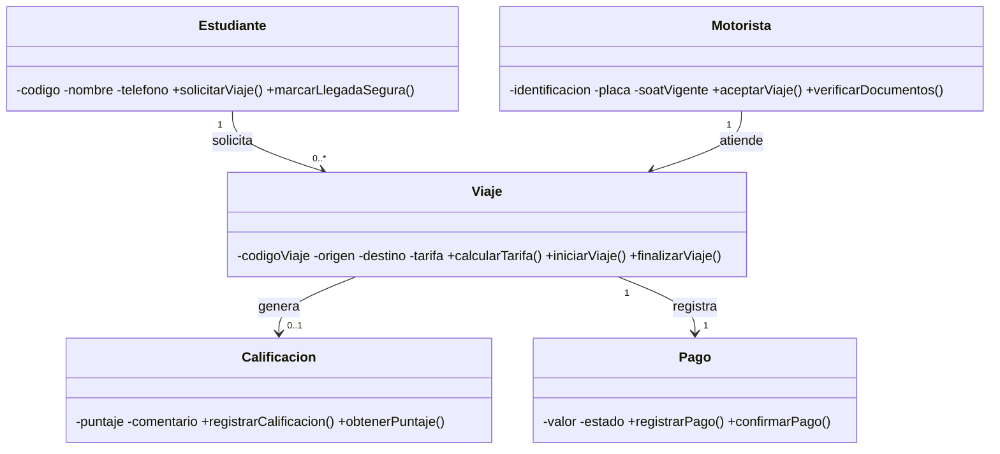

# TucanGo — Presentación del Proyecto

> **Universidad de la Amazonia — Ingeniería de Sistemas**  
> **Equipo:** Jhonatan A. Saavedra C., Gian M. Castañeda S., Andrés D. Pinilla P., Juan G. Ferrer G.  
> **Repositorio:** https://github.com/Stellel-One/TucanGo

---

## 1. Portada

# TucanGo
## Movilidad estudiantil segura en el campus
### Sistema de confianza y trazabilidad para transporte en motocicleta

---

## 2. Problemática

El transporte informal en motocicleta (mototaxis) es la opción principal de movilidad para los estudiantes del campus, pero opera **sin ningún control ni garantías**:

- **Sin registro:** no hay identificación verificada de quién conduce
- **Sin trazabilidad:** imposible saber si un viaje llegó a destino seguro
- **Tarifas arbitrarias:** no existe referencia de "pago justo"
- **Riesgo diferenciado:** mayor percepción de inseguridad en estudiantes mujeres
- **Motoristas sin respaldo:** trabajan sin formalización ni garantías

> **Dos realidades paralelas:** la comunidad universitaria y el transporte informal.  
> **TucanGo los conecta mediante verificación, trazabilidad y reputación.**

---

## 3. Objetivos

### Objetivo General
Diseñar e implementar un **sistema de confianza y trazabilidad** que formalice la relación estudiante–motorista mediante verificación de identidad, registro de viajes, reputación y pagos justos, operando dentro del ámbito de control de la Universidad.

### Objetivos Específicos
| # | Objetivo |
|---|----------|
| 1 | **Verificación de motoristas:** validar identificación, placa y SOAT vigente antes de permitir viajes |
| 2 | **Trazabilidad completa:** registrar origen, destino, hora y confirmación de llegada de cada viaje |
| 3 | **Reputación y seguridad:** sistema de calificación (1–5) y comentarios por viaje |
| 4 | **Formalización económica:** registro de tarifa acordada y estado de pago (pendiente/confirmado) |
| 5 | **Enfoque responsable:** operar solo dentro de lo que la Universidad puede controlar (campus), sin habilitar transporte público ilegal |

---

## 4. Alcance del Proyecto

### ✅ Incluido (In-scope)
- Modelo de dominio con 5 entidades: Estudiante, Motorista, Viaje, Calificación, Pago
- Verificación documental de motoristas (identificación + placa + SOAT)
- Registro de viaje: solicitud, inicio, fin, confirmación de llegada segura
- Sistema de calificación y reputación por viaje
- Registro de tarifa y estado de pago
- Arquitectura en capas (modelo, servicio, persistencia, vista)

### ❌ No incluido (Out-of-scope)
- Desarrollo de aplicación móvil nativa (iOS/Android)
- Pasarela de pagos electrónicos real
- Optimización de rutas / despacho automático
- Gestión de flotas o múltiples sedes
- Habilitación legal del transporte público en motocicleta (competencia municipal/nacional)

---

## 5. Solución: Arquitectura del Sistema

**Entidad transaccional central:** `Viaje` — vincula estudiante, motorista, calificación y pago.

---

## 6. Entidades del Modelo

| Entidad | Propósito | Atributos clave | Responsabilidad principal |
|---------|-----------|-----------------|---------------------------|
| **Estudiante** | Solicitante del servicio | `codigo`, `nombre`, `telefono` | Solicitar viaje, confirmar llegada segura |
| **Motorista** | Proveedor verificado | `identificacion`, `placa`, `soatVigente` | Aceptar viaje, verificar documentos |
| **Viaje** | Transacción núcleo | `codigoViaje`, `origen`, `destino`, `tarifa` | Calcular tarifa, iniciar/finalizar viaje |
| **Calificación** | Reputación y seguridad | `puntaje` (1–5), `comentario` | Registrar evaluación, consultar reputación |
| **Pago** | Formalización económica | `valor`, `estado` | Registrar pago, confirmar estado |

> Diseño bajo estándares POO: atributos `private`, métodos `public` verbo infinitivo, encapsulamiento.

---

## 7. Enfoque Responsable (Marco Normativo)

| Lo que TucanGo **SÍ** hace | Lo que TucanGo **NO** hace |
|----------------------------|----------------------------|
| Verifica motorista dentro del campus (docs, placa, SOAT) | ❌ Legaliza transporte público en moto |
| Registra trazabilidad completa de cada viaje | ❌ Opera fuera del ámbito universitario |
| Genera reputación mediante calificaciones | ❌ Sustituye autoridad de tránsito |
| Registra tarifa acordada y estado de pago | ❌ Procesa pagos electrónicos reales |

**Base normativa:** El transporte de pasajeros en motocicleta es ilegal a nivel nacional (Ley 336/1996, Dec. 1079/2015). La Universidad, en ejercicio de su autonomía (Ley 30/1992), puede regular **dentro de su campus** exigiendo documentos y condiciones de seguridad. TucanGo opera estrictamente en ese marco.

---

## 8. Stack Tecnológico

| Capa | Tecnología |
|------|------------|
| Lenguaje | Java (Programación Orientada a Objetos) |
| JDK | 21 (Microsoft OpenJDK) |
| IDE | Apache NetBeans |
| Build | Apache Ant |
| Control de versiones | Git + GitHub |
| Modelado | UML (Mermaid) |
| Testing | JUnit (planificado) |

---

## 9. Equipo de Trabajo

| Integrante | Rol sugerido |
|------------|--------------|
| Jhonatan Alexander Saavedra Culma | Líder / Modelado UML |
| Gian Marco Castañeda Samboni | Backend Java / Lógica de negocio |
| Andrés David Pinilla Parra | Persistencia / Pruebas |
| Juan Guillermo Ferrer Gasca | Documentación / Arquitectura |

---

## 10. Roadmap

| Fase | Actividad | Estado |
|------|-----------|--------|
| 1 | Modelo de dominio UML (5 entidades, asociaciones, multiplicidades) | ✅ Completado |
| 2 | Implementación Java: 5 clases del dominio (`src/modelo/`) | 🔄 En progreso |
| 3 | Capa `servicio` — lógica de negocio (gestión de viajes, validaciones) | ⏳ Planificada |
| 4 | Capa `persistencia` — almacenamiento (archivos / BD) | ⏳ Planificada |
| 5 | Capa `vista` — interfaz de consola / menú interactivo | ⏳ Planificada |
| 6 | Pruebas unitarias (JUnit) y de integración | ⏳ Planificada |
| 7 | Empaquetado, documentación técnica y entrega final | ⏳ Planificada |

---

## 11. Entregables del Proyecto

| Artefacto | Ubicación | Descripción |
|-----------|-----------|-------------|
| Modelo UML v1.0 | `Docs/diagrama-uml-v1.0.md` | 5 clases, asociaciones, multiplicidades, checklist |
| Código fuente Java | `src/co/edu/uniamazonia/logica2/modelo/` | 5 clases del dominio + arquitectura en capas |
| Documentación técnica | `README.md`, `Docs/` | Arquitectura, convenciones, roadmap |
| Presentación | `Docs/presentacion-proyecto.pdf` | Este documento (12 slides) |
| Gestión de tareas | `Gestion_Tareas_Equipo_LogicaII.xlsx` | Seguimiento de actividades por integrante |

---

## 12. Cierre

# TucanGo
## Conectando seguridad, confianza y formalización

> **“No modelamos para habilitar lo ilegal; modelamos para proteger a quien viaja y formalizar a quien conduce dentro de lo que la Universidad sí puede controlar.”**

---

**Repositorio:** https://github.com/Stellel-One/TucanGo  
**Contacto:** Juan Guillermo Ferrer Gasca — Equipo TucanGo  
**Universidad de la Amazonia — Ingeniería de Sistemas**