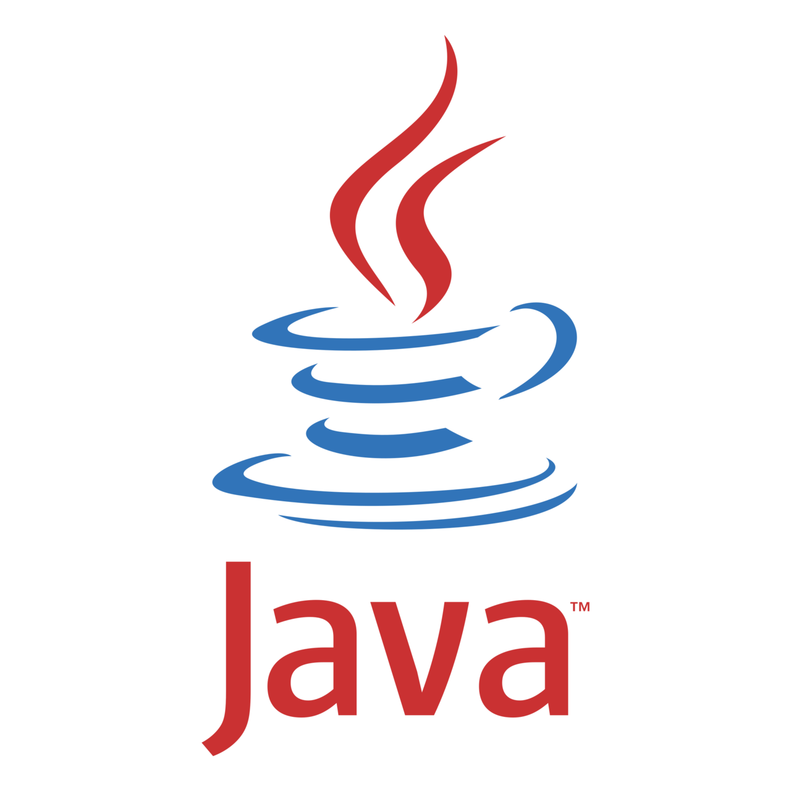
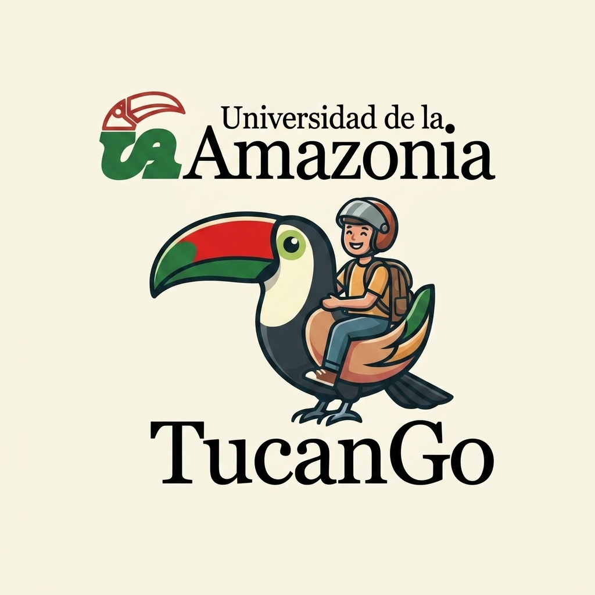
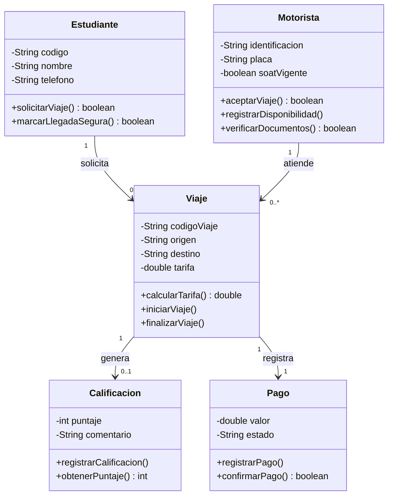

<p align="center">
  
</p>

<h1 align="center">TucanGo</h1>

<p align="center">
  <strong>Movilidad estudiantil segura en el campus</strong>
</p>

<p align="center">
  
</p>

<p align="center">
  <a href="https://github.com/Stellel-One/TucanGo"></a>
  
  
  
  
</p>

---

**TucanGo** es un proyecto académico de **Lógica & Algoritmos II** (Universidad de la Amazonia, Ingeniería de Sistemas) que aplica **Programación Orientada a Objetos en Java** para modelar una solución a una problemática real del entorno universitario.

## 🎯 Idea del proyecto

El transporte informal en motocicleta (mototaxis) es una práctica común entre los estudiantes para ir y volver del campus, pero opera **sin ningún control**: no hay registro de quién conduce, no hay tarifa definida y no hay forma de saber si un viaje fue seguro. El riesgo percibido es mayor para las estudiantes mujeres, y los motoristas trabajan sin ingreso estable ni respaldo.

**TucanGo** propone entrelazar estos dos mundos — la universidad y el transporte informal — mediante un modelo de **confianza y trazabilidad**:

- 🛡️ **Seguridad para el estudiante:** cada viaje queda registrado (quién conduce, de dónde a dónde, y confirmación de llegada), y se puede calificar el servicio.
- 🤝 **Formalización para el motorista:** trabaja sobre motoristas previamente **verificados** (identificación, placa y SOAT vigente), con "clientes" asegurados y **pagos justos** registrados.
- 🏫 **Bienestar universitario:** la Universidad actúa como garante de bienestar dentro de su ámbito (verificación y control interno), sin habilitar transporte público.

> **⚖️ Encuadre responsable:** el sistema se plantea como una capa de seguridad y confianza sobre motoristas verificados dentro del ámbito del campus. **No** habilita ni legaliza el transporte público de pasajeros en moto (actividad no permitida a nivel nacional en Colombia); se concentra en lo que la Universidad sí puede controlar: **verificación, trazabilidad, reputación y pago**.

---

## 👥 Equipo

| # | Nombre completo | Código estudiantil | Rol |
|---|-----------------|--------------------|-----|
| 1 | Jhonatan Alexander Saavedra Culma | _(pendiente)_ | _(pendiente)_ |
| 2 | Gian Marco Castañeda Samboni | _(pendiente)_ | _(pendiente)_ |
| 3 | Andrés David Pinilla Parra | _(pendiente)_ | _(pendiente)_ |
| 4 | Juan Guillermo Ferrer Gasca | _(pendiente)_ | _(pendiente)_ |

---

## 📐 Diagrama UML v1.0 (Entregable Guía 2)

GitHub renderiza el diagrama Mermaid directamente abajo. También disponible en [`Docs/diagrama-uml-v1.0.md`](Docs/diagrama-uml-v1.0.md) con versión textual para Bitácora impresa.



**Resumen del modelo (Guía 2):**
- ✅ 5 clases (`Estudiante`, `Motorista`, `Viaje`, `Calificacion`, `Pago`)
- ✅ Mínimo 2 atributos + 1 responsabilidad **justificada** por clase
- ✅ 4 asociaciones con multiplicidades lógicas (`1..*`, `0..1`, `1..1`)
- ✅ Checklist de validación completo y encuadre responsable

---

## 📚 Documentación

| Documento | Qué contiene |
|-----------|--------------|
| [`Docs/diagrama-uml-v1.0.md`](Docs/diagrama-uml-v1.0.md) | **Entregable Guía 2**: Bitácora, señal/ruido, 5 clases, asociaciones, UML Mermaid + textual, checklist |
| [`Docs/modelo-conceptual.md`](Docs/modelo-conceptual.md) | Modelo conceptual detallado (Guías 1 y 2) |
| `Docs/Sem1Est (1).pdf` | Guía 1 del profesor (Semana 1) |
| `Docs/Sem2_Expo2.pdf` | Guía 2 del profesor (Semana 2 — diapositivas) |
| `openspec/` | Configuración SDD para fases futuras |
| `Gestion_Tareas_Equipo_LogicaII.xlsx` | Gestión de tareas del equipo (4 integrantes) |

---

## ⚙️ Stack técnico

| Aspecto | Valor |
|---------|-------|
| Lenguaje | Java (POO) |
| JDK | 21 (Microsoft OpenJDK) |
| IDE | Apache NetBeans |
| Build | Apache Ant (Java with Ant) |
| Rama | `master` |

---

## 🗂️ Estructura del repositorio

```
.
├── .gitignore
├── README.md
├── Docs/
│   ├── Sem1Est (1).pdf
│   ├── Sem2_Expo2.pdf
│   ├── modelo-conceptual.md
│   ├── diagrama-uml-v1.0.md
│   ├── java-logo-1.png
│   ├── java-logo-2.png
│   └── Gemini_Generated_Image_bawbewbawbewbawb.jpg
├── openspec/
│   ├── config.yaml
│   ├── specs/
│   └── changes/
├── Gestion_Tareas_Equipo_LogicaII.xlsx
└── src/
    └── co/edu/uniamazonia/logica2/
        ├── Main.java
        └── modelo/
            └── SensorAmbiental.java   ← Plantilla Guía 1 (ejemplo)
```

> **Nota:** `SensorAmbiental` es una **plantilla de ejemplo** de la Guía 1 que ilustra los estándares de codificación; no corresponde al dominio real. Las entidades definitivas (`Estudiante`, `Motorista`, `Viaje`, `Calificacion`, `Pago`) se modelan en [`Docs/diagrama-uml-v1.0.md`](Docs/diagrama-uml-v1.0.md).

---

## 🏗️ Arquitectura en capas (futura implementación)

| Capa | Paquete | Responsabilidad | Estado |
|------|---------|-----------------|--------|
| `modelo` | `co.edu.uniamazonia.logica2.modelo` | Entidades del dominio del problema | Creada ahora |
| `servicio` | `co.edu.uniamazonia.logica2.servicio` | Lógica de negocio | Futura |
| `persistencia` | `co.edu.uniamazonia.logica2.persistencia` | Acceso a datos | Futura |
| `vista` | `co.edu.uniamazonia.logica2.vista` | Presentación / consola | Futura |
| `util` | `co.edu.uniamazonia.logica2.util` | Helpers transversales | Futura |

---

## 📏 Convenciones de codificación (estándares del curso)

| Elemento | Regla | Ejemplo |
|----------|-------|---------|
| Clase | Sustantivo en singular, UpperCamelCase | `Motorista`, `Viaje` |
| Atributo | `private`, lowerCamelCase | `private String placa;` |
| Método | `public`, verbo en infinitivo, lowerCamelCase | `aceptarViaje()`, `calcularTarifa()` |
| Tipos | Coherentes con el dato | `String`, `int`, `double`, `boolean` |
| Encapsulamiento | Atributos privados + getters/setters | `getTarifa()` / `setTarifa(...)` |

**Notas:**
- Para atributos `boolean`, el getter usa `is` (JavaBeans): `isSoatVigente()`.
- Javadoc en español, sin jerga regional.

---

## 🗺️ Roadmap

- [ ] Confirmar los 4 integrantes del equipo y completar la tabla.
- [ ] Traducir el modelo conceptual (5 clases) a código Java del dominio (`src/.../modelo/`).
- [ ] Agregar la capa `servicio` con la lógica de negocio.
- [ ] Agregar la capa `persistencia` para guardar/cargar datos.
- [ ] Conectar la capa `vista` (menú por consola).
- [ ] Incorporar JUnit para pruebas unitarias.

---

<p align="center">
  <sub>Proyecto académico — Universidad de la Amazonia — Ingeniería de Sistemas — Lógica & Algoritmos II</sub>
</p>